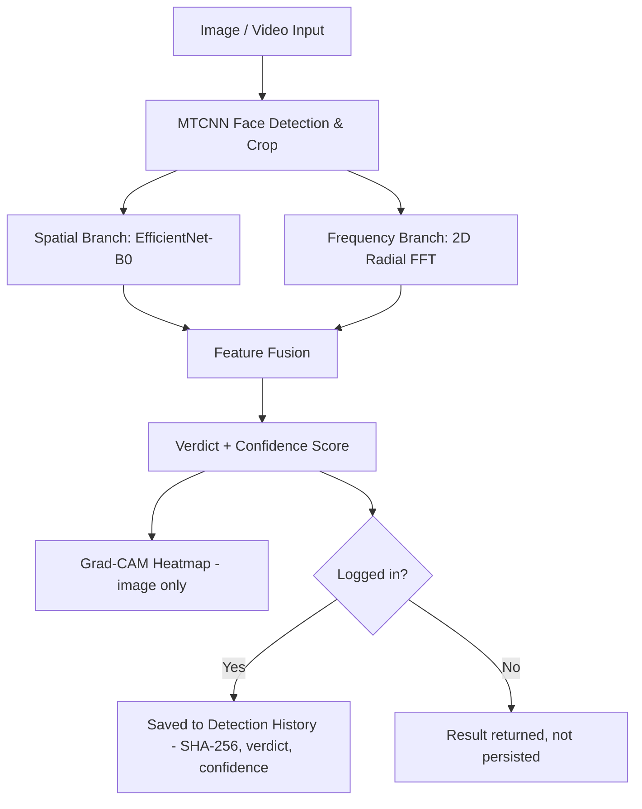
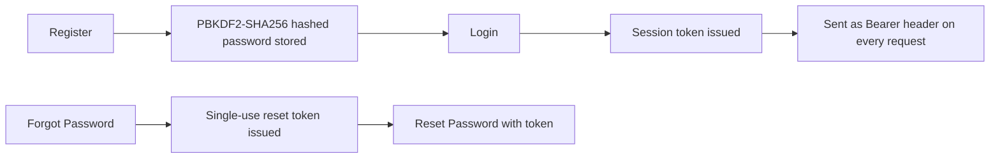

# 🛡️ Sentinel — Deepfake Detector


AI-powered deepfake detection for images and video: a dual-branch neural network (spatial CNN + frequency-domain analysis) classifies media as real or synthetic, explains its own decisions with Grad-CAM heatmaps, and honestly reports where it fails — behind a real login system, with per-account detection history and analytics computed from actual usage, not placeholder data.

Built as a college project combining **Machine Learning Research**, **Backend Engineering**, and **Frontend Development**.

## 📖 Table of Contents

- [Overview](#-overview)
- [Features](#-features)
- [Tech Stack](#-tech-stack)
- [System Pipeline](#-system-pipeline)
- [Authentication](#-authentication)
- [Project Structure](#-project-structure)
- [Getting Started](#-getting-started)
- [Application Pages](#-application-pages)
- [Project Task Tracker](#-project-task-tracker)
- [Quality Assurance & Bug Fixes](#-quality-assurance--bug-fixes)
- [Dataset Notes](#-dataset-notes)
- [Research Findings](#-research-findings)
- [Known Limitations](#-known-limitations)

## 🔭 Overview

Most student deepfake detectors report one inflated accuracy number and stop there. This project does the opposite: it builds a real dual-branch classifier, measures it rigorously, and treats the moments it fails — badly — as the most important findings in the whole build.

A user uploads an image or video, the backend crops the face, extracts both spatial (CNN) and frequency-domain (2D FFT) features, fuses them through a dual-branch classifier, and returns a verdict with a confidence score and a Grad-CAM heatmap explaining *why*. Every analysis is saved to a real per-account history, and an analytics dashboard aggregates real usage stats — no simulated figures anywhere in the app.

## ✨ Features

- 🧠 **Dual-Branch Detection** — EfficientNet-B0 spatial features fused with a 2D radial FFT spectral branch
- 🔍 **Grad-CAM Explainability** — visual heatmap showing which regions of a face drove the verdict
- 🎞️ **Video Frame Analysis** — samples frames from uploaded video, runs per-frame inference, aggregates to a verdict with a visual timeline
- 🔐 **Real Authentication** — signup/login, PBKDF2-hashed passwords, session tokens, working forgot/reset password flow
- 📜 **Detection History** — every scan saved with a real SHA-256 buffer hash, searchable and filterable, scoped to its owner, with **CSV export** and **PDF print**
- 📊 **Analytics Dashboard** — verdict breakdown, media-type split, and scan timeline computed live from your own history
- 👤 **Full Profile Management** — editable name/organization, secure change-password (current password verified), profile photo upload
- 🌗 **Dark / Light Theme** — theme toggle built on CSS custom properties, persisted across sessions
- 🧪 **Honest Generalization Testing** — explicitly measures and reports how badly the model fails outside its training distribution, and what fixed it

## 🛠️ Tech Stack

| Layer             | Technology                                                                    |
| ----------------- | ----------------------------------------------------------------------------- |
| 🧠 Computer Vision | EfficientNet-B0 (via `timm`) + 2D FFT radial spectral features                |
| 👤 Face Detection  | MTCNN (via `facenet-pytorch`)                                                 |
| 🔍 Explainability  | `pytorch-grad-cam` (Grad-CAM, wrapped for dual-input model)                   |
| ⚙️ Backend        | Python, FastAPI                                                               |
| 🔐 Auth            | Token-based sessions, PBKDF2-SHA256 password hashing, single-use reset tokens |
| 🗄️ Database       | SQLite                                                                        |
| 🎨 Frontend        | React + Vite, Tailwind CSS v4, custom hash-based router                       |
| 🚀 Deployment      | Local (Docker planned)                                                        |

## 🔄 System Pipeline



For video, frames are sampled at a fixed interval, each run through the same per-frame pipeline, and results are aggregated into a single verdict with a per-frame confidence timeline.

## 🔐 Authentication



- Passwords are hashed with **PBKDF2-SHA256** and a per-user random salt — never stored in plain text.
- Session tokens expire after 7 days.
- Password reset tokens are single-use and expire after 30 minutes. Since this is a local demo with no email server configured, the reset token is returned directly in the API response instead of being emailed — clearly labeled as such in the UI.
- `/history`, `/analytics`, and `/profile` endpoints all require a valid Bearer token; every user only ever sees their own detection history, analytics, and profile data.

## 📁 Project Structure

```
Sentinel/
├── backend/
│   ├── app.py                  # FastAPI app: auth, predict, history, analytics, profile
│   ├── database.py             # SQLite schema, auth helpers, history/analytics queries
│   └── models/                 # trained checkpoints (not committed — see Getting Started)
├── frontend/
│   ├── index.html
│   ├── package.json
│   ├── vite.config.js
│   └── src/
│       ├── App.jsx             # routing (hash-based, no router dependency)
│       ├── main.jsx
│       ├── api.js              # backend client, token storage
│       ├── index.css           # Tailwind entry + theme CSS variables
│       ├── components/
│       │   ├── Header.jsx
│       │   └── Footer.jsx
│       ├── context/            # global auth + theme state
│       ├── hooks/
│       │   └── useHashRoute.jsx
│       └── pages/
│           ├── Landing.jsx     # public results/overview page
│           ├── Login.jsx       # login / signup / forgot / reset
│           ├── Lab.jsx         # forensic analysis workspace
│           ├── History.jsx     # detection history + inspector, CSV export / PDF print
│           ├── Analytics.jsx   # real usage analytics
│           └── Profile.jsx     # account, password, photo
├── notebooks/                  # training & evaluation notebooks
├── datasets/                   # not committed — see Dataset Notes
└── results/                    # saved evaluation metrics (JSON/CSV)
```

## 🚀 Getting Started

### Prerequisites

- Python 3.10+
- Node.js 18+
- (Optional) NVIDIA GPU + CUDA for faster inference

### Clone the repository

```
git clone https://github.com/adityyapratapsingh22/Sentinel.git
cd Sentinel
```

### Backend setup

```
cd backend
python -m venv venv
venv\Scripts\Activate.ps1      # Windows PowerShell
pip install torch torchvision torchaudio --index-url https://download.pytorch.org/whl/cu121
pip install "numpy<2.0.0" fastapi "uvicorn[standard]" python-multipart timm facenet-pytorch opencv-python-headless grad-cam

# Trained model checkpoints are not committed to this repo (large binaries).
# Place your own .pth files in backend/models/, or retrain using the notebooks in /notebooks.

uvicorn app:app --reload
```

> **Tip:** always install PyTorch with the `--index-url` above, otherwise pip can silently pull the CPU-only build. If you retrain on Windows, use `num_workers=0` in the DataLoader.

### Frontend setup

```
cd frontend
npm install
npm run dev
```

Open the Vite dev server URL (typically `http://localhost:5173`) with the backend running at `http://127.0.0.1:8000`. Register a new account to get started — all analysis features require being signed in.

## 🖥️ Application Pages

| Page                        | Purpose                                                                | Status |
| --------------------------- | ---------------------------------------------------------------------- | ------ |
| 🏠 Landing                   | Public overview page — real measured results, no fabricated benchmarks | ✅ Live |
| 🔑 Login                     | Real authentication against the backend                                | ✅ Live |
| 📝 Signup                    | Create a new account                                                   | ✅ Live |
| 🔓 Forgot Password           | Request a real reset token                                             | ✅ Live |
| 🔐 Reset Password            | Set a new password via the issued token                                | ✅ Live |
| 🔬 Forensic Lab              | Upload image/video, run dual-branch inference, view Grad-CAM + FFT     | ✅ Live |
| 📜 Audit Ledger (History)    | Real per-account history, filterable, SHA-256 hashes, CSV / PDF export | ✅ Live |
| 📊 Threat Matrix (Analytics) | Real KPIs and charts computed from your own history                    | ✅ Live |
| 👤 Workspace (Profile)       | Edit name/org, change password, upload profile photo                   | ✅ Live |

## ✅ Project Task Tracker

### Phase 1–2: Image Classifier

| Task                                         | Status |
| -------------------------------------------- | ------ |
| Environment setup (PyTorch + CUDA)           | ✅ Done |
| Face detection/cropping (MTCNN)              | ✅ Done |
| EfficientNet-B0 fine-tuning                  | ✅ Done |
| 2D FFT frequency branch (dual-branch fusion) | ✅ Done |
| Grad-CAM explainability                      | ✅ Done |
| Cross-generator generalization testing       | ✅ Done |

### Phase 3: Video Pipeline

| Task                                                      | Status |
| --------------------------------------------------------- | ------ |
| Frame sampling + per-frame inference                      | ✅ Done |
| Aggregation strategy testing (mean/max/variance)          | ✅ Done |
| Video-level train/test split, fine-tuning on video frames | ✅ Done |

### Phase 4: Backend & Frontend

| Task                                                              | Status |
| ----------------------------------------------------------------- | ------ |
| FastAPI backend with `/predict/image`, `/predict/video`           | ✅ Done |
| Auth (signup/login/forgot/reset), SQLite persistence              | ✅ Done |
| Detection history (real SHA-256, filterable, paginated)           | ✅ Done |
| History export (CSV download, PDF print)                          | ✅ Done |
| Analytics (real aggregate queries)                                | ✅ Done |
| Profile (edit info, change password, photo upload)                | ✅ Done |
| React frontend (Landing, Login, Lab, History, Analytics, Profile) | ✅ Done |
| Dark / light theme (CSS variables, persisted)                     | ✅ Done |

### Deployment & Extras

| Task                                          | Status        |
| --------------------------------------------- | ------------- |
| Further fine-tuning for real-world generalization | 🔄 In progress |
| Docker packaging                              | ❌ Not started |
| Cloud deployment                              | ❌ Not started |

## 🔧 Quality Assurance & Bug Fixes

A number of real bugs were found and fixed during development. Documented here for transparency:

| Issue                                                                      | Severity           | Fix                                                                                                                                                                                                      |
| -------------------------------------------------------------------------- | ------------------ | -------------------------------------------------------------------------------------------------------------------------------------------------------------------------------------------------------- |
| Frozen CNN backbone gave near-random (~52%) accuracy                       | 🔴 Critical         | Unfroze and fully fine-tuned the backbone — accuracy jumped to 83%+                                                                                                                                      |
| Wrong image normalization (plain `0.5` mean/std instead of ImageNet stats) | 🟠 Bug              | Corrected to proper ImageNet mean/std, fixing degraded feature quality                                                                                                                                   |
| `numpy` 2.x silently breaking `torch`/`facenet-pytorch` compatibility      | 🟠 Robustness       | Pinned `numpy<2.0.0`; recurred multiple times from transitive installs and was fixed each time                                                                                                           |
| PyTorch silently falling back to CPU after install                         | 🟡 Environment      | Install with the explicit CUDA `--index-url` (cu121) so the GPU build is used                                                                                                                            |
| Grad-CAM silently failing on every single request                          | 🔴 Critical         | The library calls `model(input_tensor)` with one argument, but the dual-branch model needs two (`img`, `fft_feat`). Fixed with a per-request adapter module that wraps the model and closes over the fixed FFT features. |
| Model gave unstable, near-random output after loading from checkpoint      | 🟠 Bug              | Missing `.eval()` call after reloading — model was left in training mode, destabilizing BatchNorm behavior                                                                                               |
| Model completely failed to detect face-swap video deepfakes (0% recall)    | 🔴 Critical / Model | Root-caused to a distribution mismatch (model only ever saw StyleGAN stills); fixed via targeted fine-tuning on a held-out video split — recall recovered to 82%                                         |
| Hardcoded colors made a theme switch impossible                            | 🟡 UX               | Replaced hardcoded hex values across the frontend with CSS custom properties, enabling persisted dark/light mode                                                                                         |

## 📊 Dataset Notes

- **Images**: 140k Real and Fake Faces (StyleGAN, Kaggle) — a 3,000-image working subset used for fast iteration during development.
- **Cross-generator test set**: Stable Diffusion Face Dataset (Kaggle) — used specifically to test generalization to an unseen generation method.
- **Video**: SDFVD (Small-scale Deepfake Forgery Video Dataset) — 53 real + 53 fake videos, split 80/20 **by video** (not by frame) to prevent data leakage during fine-tuning and evaluation. Fine-tuning used a gentle schedule (1 epoch, learning rate 5e-5) to adapt to video without forgetting the image features.

## 🔬 Research Findings

The most valuable result in this project isn't the headline accuracy — it's what happens outside the training distribution:

| Scenario                                              | Result                                                        |
| ----------------------------------------------------- | ------------------------------------------------------------- |
| In-distribution (StyleGAN images, held-out test set)  | **92.0% accuracy, 0.974 AUC-ROC**                             |
| Out-of-distribution images (Stable Diffusion, unseen) | Fake recall collapsed from 90% → **2.3%**, confidently wrong  |
| Out-of-distribution video (face-swap, unseen)         | **50% accuracy / 0% fake recall** — every video called "real" |
| Face-swap video, after targeted fine-tuning           | **77% accuracy / 82% fake recall** on held-out videos         |

Adding the FFT branch lifted in-distribution accuracy from roughly 83% to 92%. But the model learned StyleGAN-specific frequency artifacts, not a general notion of "fakeness" — and it failed *confidently*, not uncertainly, on unseen manipulation types. Exposing it to a small amount of representative data recovered real detection capability. This is documented honestly throughout the app rather than hidden behind a single inflated metric.

## ⚠️ Known Limitations

- Detection accuracy is strong within the training distribution but not guaranteed against manipulation methods not represented in training or fine-tuning data; generalization to arbitrary real-world fakes is still an open problem.
- Dataset sizes (especially for video fine-tuning) are small; results should be read as a research demonstration, not a production-grade guarantee.
- This is a research/educational tool, not a forensic-grade legal instrument — it has no cryptographic chain-of-custody, watermark verification, or third-party certification, and makes no such claims.
- Single account per user, no admin panel or multi-tenant management — designed for local, individual use.
